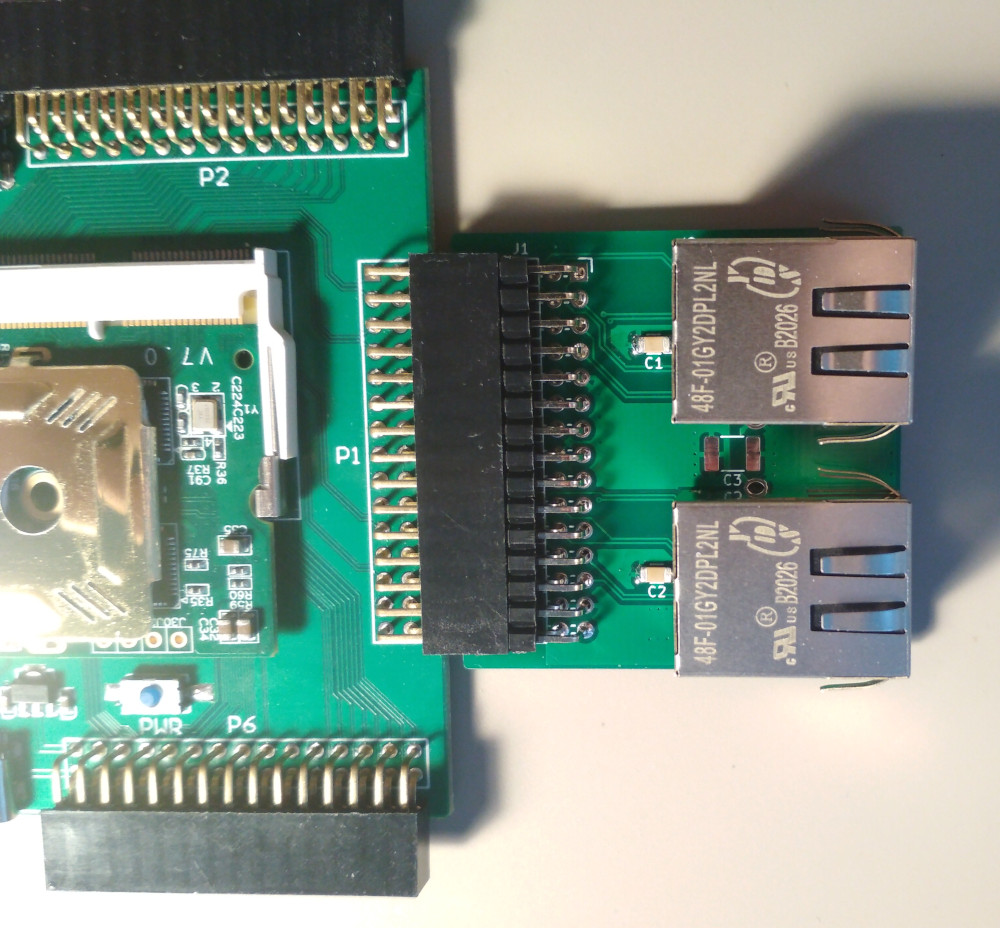

# `colorlight-i5-ethernet`

Dual gigabit Ethernet interface board for [Colorlight i5 Extension Board](https://github.com/wuxx/Colorlight-FPGA-Projects). 

This board is based on [i5ether](https://github.com/kazkojima/colorlight-i5-tips/) project by
[@kazkojima](https://github.com/kazkojima).

Manufactured on JLCPCB (see `gerbers` directory). Tested with the [colorlight_i5.py example](https://github.com/litex-hub/litex-boards/blob/master/litex_boards/targets/colorlight_i5.py)
from LiteX.

# Bill of Materials

| Item                        | Part #               | LCSC Part # | Qty |
|-----------------------------|----------------------|-------------|-----|
| Connector (J1)              | X6521WR-2x15H-C30D60 | [C725927]   | 1   |
| Ethernet connector (J2, J3) | 48F-01GY2DPL2NL      | [C123172]   | 2   |
| Capacitor (C1, C2)          | GRM319R71H104KA01D   | [C86047]    | 2   |
| Capacitor (C3)              | 1812B472K202CT       | [C304036]   | 1   |

[C123172]: https://lcsc.com/product-detail/Ethernet-Connectors-Modular-Connectors-RJ45-RJ11_Shanghai-YDS-Tech-48F-01GY2DPL2NL_C123172.html
[C86047]: https://lcsc.com/product-detail/Multilayer-Ceramic-Capacitors-MLCC-SMD-SMT_Murata-Electronics-GRM319R71H104KA01D_C86047.html
[C304036]: https://lcsc.com/product-detail/Multilayer-Ceramic-Capacitors-MLCC-SMD-SMT_Walsin-Tech-Corp-1812B472K202CT_C304036.html
[C725927]: https://lcsc.com/product-detail/Pin-Headers_XKB-Connectivity-X6521WR-2x15H-C30D60_C725927.html
